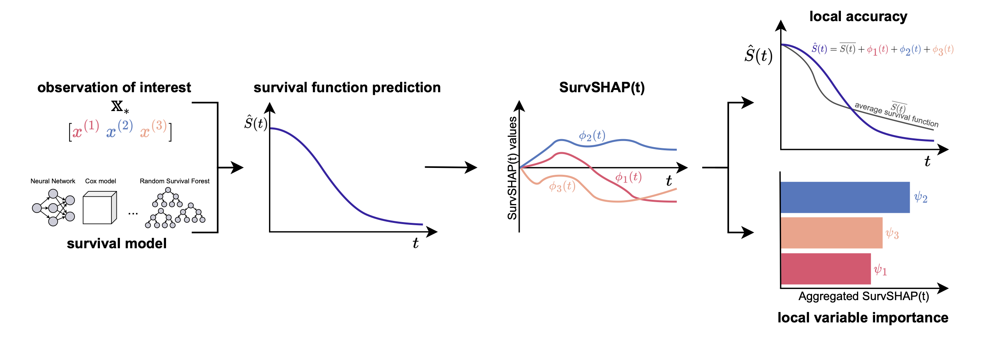

# SurvSHAP(t)

This repository contains data and code for the article:

M. Krzyziński, M. Spytek, H. Baniecki, P. Biecek. *SurvSHAP(t): Time-dependent explanations of machine learning survival models*. **Knowledge-Based Systems**, 262:110234, 2023. https://doi.org/10.1016/j.knosys.2022.110234

```bib
@article{survshap,
    title = {SurvSHAP(t): Time-dependent explanations of machine learning survival models},
    author = {Mateusz Krzyziński and Mikołaj Spytek and Hubert Baniecki and Przemysław Biecek},
    journal = {Knowledge-Based Systems},
    volume = {262},
    pages = {110234},
    year = {2023}
}
```




## Implementations
In the `survshap_package` directory, you will find the code for *survshap* Python package, which contains the implementation of the SurvSHAP(t) method. **Now you can also easily install it from PyPI:**
```
pip install survshap
```

**NOTE:** SurvSHAP(t) and SurvLIME are also implemented in the [*survex*](https://github.com/ModelOriented/survex) R package, along with many more explanation methods for survival models. *survex* offers explanations for *scikit-survival* models loaded into R via the *reticulate* package.


## Additional materials
In addition to the package, the repository also contains the materials used for the article (in the `paper` directory). 

### `other_codes`
- `survlime.py` is the [SurvLIME](https://www.sciencedirect.com/science/article/abs/pii/S0950705120304044) method implementation
- `survnam` directory contains the [SurvNAM](https://www.sciencedirect.com/science/article/abs/pii/S0893608021004949) method implementation (based on [Jia-Xiang Chengh implementation](https://github.com/jiaxiang-cheng/PyTorch-SurvNAM))
- `data_generation.R` is the code for synthetic censored data generation (for Experiments 1 and 2)
- `plots.R` is the code for creating Figures from the article

### `data`
- `data` directory contains the datasets used in experiments

### `experiments`
- `experiments` directory contains Jupyter Notebooks (`*.ipynb` files) with code of the conducted experiments 

### `plots`
- `plots` directory contains Figures in `.pdf` format

### `results`
- `results` directory contains results of the conducted experiments stored in `.csv` files
